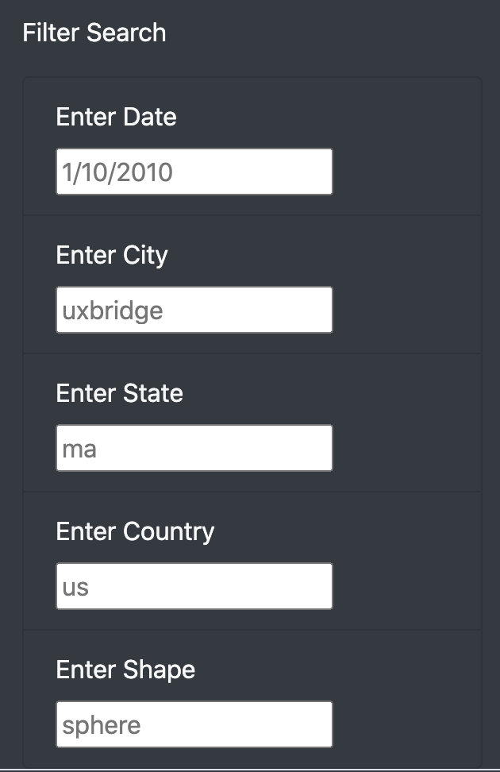
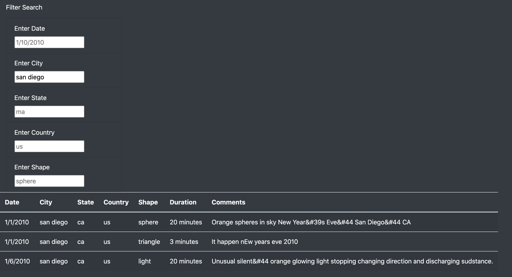
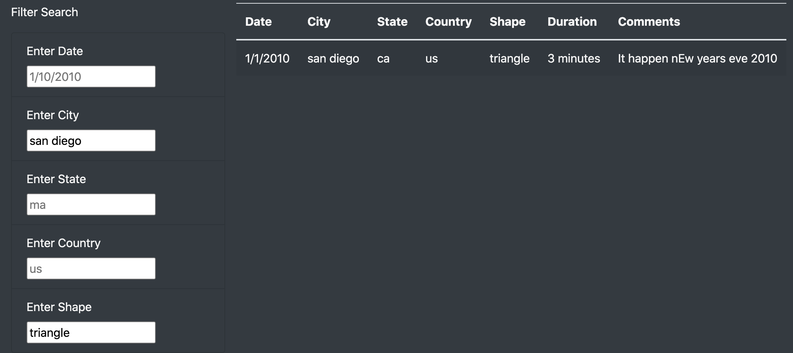

# UFO Sighting Webpage

## Overview of the analysis 

### Purpose

The purpose of this analysis to assist Dana, a data journalist intrigued by UFOs, in creating a dynamic filtered table using JavaScript to sort through all data and descriptions of UFO sightings around the world. This table will be the main component of an engaging website using HTML for UFO enthusiasts curious about sightings near them. 

The following report will outline the website and explain how to filter through the data based on user input. The report will also present any drawbacks and recommendations for further development of the website.

## Results

### Instructions on how to search through the website

1. To enter the website, click the below link. You will arrive at the home page for "UFO Sightings," displaying a jumbotron header and an article as a preface for your search. 

 

2. Scroll down to see the filter search table with five different parameters to finetune your search for more information on UFO sightings around the world. The parameters include date, city, state, country, and shape. 

3. Filter your search by entering in any one of the search filter type boxes. In the below example, I typed "San Diego" into the City search bar to filter out all data except three rows of data describing three different sightings in San Diego. 

4. Continue to filter your search further by entering your search criteria into multiple boxes. For example, I typed "triangle" to filter my search further, resulting in one data entry fulfilling both the City and Shape search parameters. 

## Summary

### Drawbacks
The filter search table is located on only one area of the webpage, sitting on top of the data table below. If my search criteria result in under 10 data entries, I can see both the search criteria and data entries without moving up and down the web page. However, if my search criteria result in a significant number of entries, losing sight of my original search filters. This drawback could result in users forgetting their search criteria while scrolling down to review the data, causing them to scroll up and down unnecessarily. 

### Recommendations
1. Create filters within the data table so that the header remains frozen while scrolling through the filtered data. 
2. Use Python/Pandas to clean the data so that the Comments don't have unnecessary symbols or spelling mistakes. 
